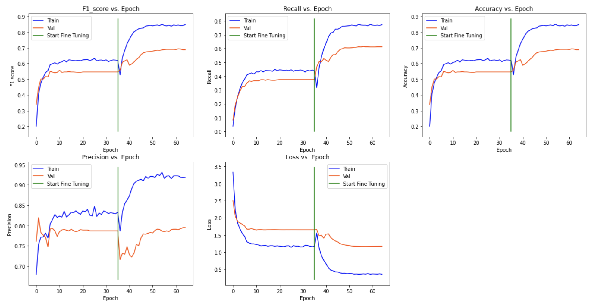

# Predicting Artists from Artwork with High Class Imbalance using Transfer Learning

## Motivation

Having done many classification problems with CNNs using TensorFlow, none of them been particulary imbalanced. Class imbalance is fruitful the real world and it's an important skill to learn how to handle class imbalances. Moreover, I am a very artist individual which attracted me to this dataset. Due to the huge class imbalance in the number of artworks for each artist, this dataset would definitely be challenging and I wanted to see how well my model would perform.

## About Dataset

The dataset contains artwork from 50 of the most influential artists of all time.  [https://www.kaggle.com/ikarus777/best-artworks-of-all-time]

## Results

The training metrics using MobileNet with class weights to handle the class imbalance can be seen below:

After fine-tuning the model, we get the following metrics:

The confusion matrix for the model predictions:

Inference on new data with green indicating correct predictions and red indicating false predictions.

## Final Thoughts

This dataset was definitely challenging but also taught me a lot of how to handl class imbalance for image and non-image problems. While there is a lot of different artists (classes), I don't believe there is enough overall data to make accurate predictions. The loss shows a huge variance problem which could be address with more data.
